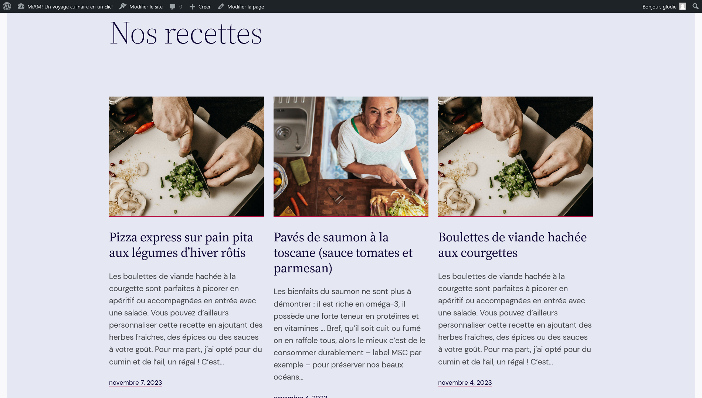

# Exercice 1 : blog

---

## Ressources

- [Images libres de droit](https://unsplash.com/)
- [Faux texte avec du Lorem Ipsum](https://fr.lipsum.com/)
- [Les autres ressources concernant les fonts, images, vidéos, etc.](./README.md)

---

## Énoncé

1. Créez un nouveau site depuis LocalWP
2. Gardez le thème par défaut
3. Créez un blog sur le sujet de votre choix (recette, actualités, sport, voitures)

### Exigences pour les articles

- [x] Au moins 3 articles
- [x] Un titre, du texte, une image et une référence (un lien vers un site connu qui traite le même sujet que votre article)
- [x] Des catégories
- [x] Des étiquettes
- [x] Attribuez à vos articles une catégorie principale et un ou plusieurs étiquettes

#### Exemple du rendu attendu

Page de tous les articles

---

Page de l'article détaillé

