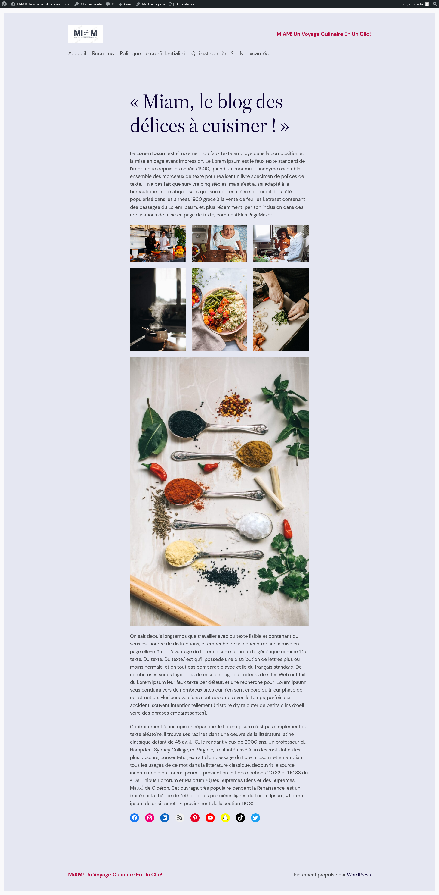
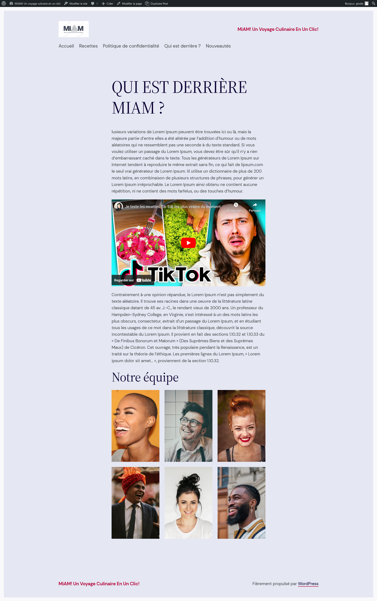

# Exercice 2 : suite au blog

---

## Ressources

- [Images libres de droit](https://unsplash.com/)
- [Faux texte avec du Lorem Ipsum](https://fr.lipsum.com/)
- [Les autres ressources concernant les fonts, images, vidéos, etc.](./README.md)

---

## Énoncé

1. À partir de votre blog créé dans l'exercice 1, ajoutez les éléments ci-dessous dans les exigences

### Exigences

#### Pour la page d'accueil

1. Créez une page d'accueil contentant :

- [x] Un titre
- [x] Du texte
- [x] Une galerie d'image
- [x] Les boutons pour les réseaux sociaux

#### Pour la page "Qui sommes-nous ?"

1. Créez une page contentant :
- [x] Un titre
- [x] Du texte
- [x] Une vidéo YouTube
- [x] Une galerie photo

#### Exemple du rendu attendu

Accueil

---

Page de "qui sommes-nous"

