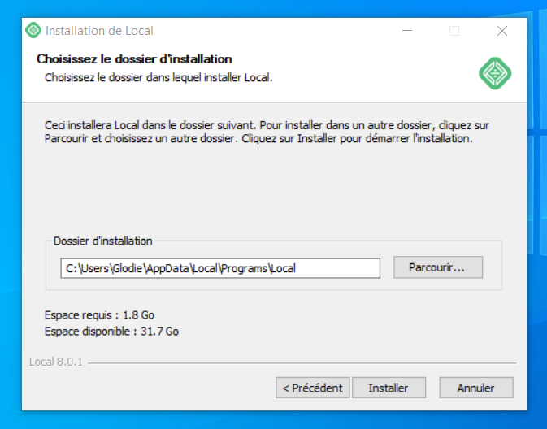
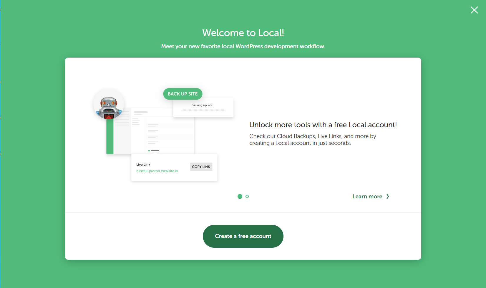

# Cours initiation WORDPRESS

---

## Guide d'installation en local avec le logiciel localwp.com

1. Téléchargez les ressources mise à votre disposition sur Teams ou rendez-vous directement sur le site [localWP](https://local.getflywheel.com/) pour télécharger le logiciel qui va vous permettre de créer des sites Wordpress en local.

---

## Suivre les différents visuels lors de votre installation

---

---

---

---

---

---

---

---

---

---

---

---

